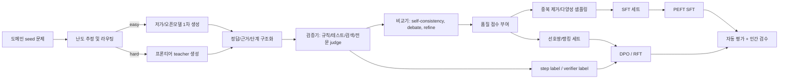

# 전문 도메인 추론 궤적 추출과 소형 모델 증류를 위한 심층 리서치 보고서

## 리서치 요청 프롬프트 (원 질문)

> 웹 검색 codex 사용량이 너무 많아서 아까워서
> https://github.com/guny524/distillation 이런거로 남은 구독제 사용량을 써서 거대 frontier 모델에서 distillation 을 하고 싶은데
> https://github.com/EvanZhouDev/openai-oauth codex exec 가 아니라 이런 걸 사용해서 api 형식으로 사용할 수도 있긴해, 근데 뭐 그건 구현의 디테일 문제고 --- 결국 frontier 모델에서 뭐가 cot 등을 뽑아내려면 질문을 던져야하는데 내가 nvidia 에서 공개한 한국인 페르소나 로 한국인이 할만한 질문들 set 을 magpie 같은 걸로 생성해서 뽑아봤는데, 질문들이 별 영양가가 없더라고 결국 뽑아내고 싶은건 specialize 된 전문 domain 지식, 깊게 생각하고 문제를 해결하는 방법의 trajectory 를 뽑아내고 싶은건데 이런걸 뽑아내려면 어떻게 해야해? 논문 기반으로 답변을 해줘

## 정정 (2026-07-11): Executive summary의 hidden CoT 서술

- 바로 아래 Executive summary 첫 문장("hidden CoT를 그대로 벗겨내어 먹이겠다는 발상은 불안정하다")은 질문 의도를 잘못 잡은 straw man이므로 무시할 것
- 질문자는 처음부터 [Proxy-KD (arXiv 2401.07013)](https://arxiv.org/abs/2401.07013) 같은 observable output 기반 black-box distillation을 전제로 두고, "어떤 질문 분포 p(x)를 설계해야 전문 지식과 깊은 문제 해결 trajectory를 뽑아낼 수 있는가"를 물었음, 모델 내부 hidden state를 벗겨내겠다는 전제가 아님
- 올바른 서술: 프론티어 모델의 내부 상태를 볼 수 없더라도, 모델이 명시적으로 출력한 rationale·analysis·tool-use trajectory는 black-box hard-label로 충분히 distill할 수 있다, 성패를 좌우하는 것은 hidden CoT 접근 여부가 아니라 질문 분포의 가치, trajectory 검증, student-teacher capability gap, 그리고 Proxy-KD를 사용할 경우 proxy alignment 품질이다
- Proxy-KD 논문에서 실제로 "불안정"한 것은 trajectory 추출 행위가 아니라, teacher와 정렬되지 않은 proxy의 token distribution(soft label)을 신뢰하는 것 (proxy alignment 제거 시 BBH -10.40, GSM8K -5.53)

## Executive summary

이 주제에서 가장 중요한 결론은 하나다. **“프론티어 모델의 내부 hidden CoT를 그대로 벗겨내어 학생 모델에 먹이겠다”는 발상은 기술적으로도, 정책적으로도, 평가적으로도 불안정하다.** 최근 OpenAI 문서와 모델 스펙은 일부 reasoning 모델이 hidden chain-of-thought를 내부적으로 사용하지만 이를 사용자나 개발자에게 직접 노출하지 않고, 필요하면 요약된 reasoning summary만 제공한다고 명시한다. 동시에 CoT faithfulness 연구들은 모델이 말한 추론이 실제 의사결정 과정을 항상 충실하게 반영하지 않으며, 더 강한 모델일수록 오히려 비충실한 CoT를 보일 수 있다고 보고한다. 따라서 실무적으로는 **raw hidden CoT 추출 중심 전략보다, 관측 가능한 고품질 trajectory를 구조화해서 수집·검증·증류하는 전략**이 더 견고하다. [[1]](https://model-spec.openai.com/2025-02-12.html) [[2]](https://openai.com/index/learning-to-reason-with-llms/) [[3]](https://arxiv.org/abs/2307.13702) [[4]](https://arxiv.org/abs/2503.08679)

그 구조화된 trajectory란 구체적으로는 다음과 같은 산출물이다. 문제 분해, 가정 선언, 근거 문헌/조문/테스트 참조, 대안 가설 비교, 오류 탐지와 수정 기록, 최종 답변 전 검증 단계, 불확실성 표기, 그리고 가능하다면 verifier 점수나 process label이다. 이 방향은 Distilling Step-by-Step, Orca, Orca 2, STaR, Let’s Verify Step by Step, 최근의 CoT distillation 연구들과 잘 맞는다. 즉, **“정답+짧은 구조화 rationale+검증 흔적”**이 많은 경우 raw 장문 CoT보다 더 학습 가능하고, 더 재현 가능하며, 더 비용 효율적이다. [[5]](https://arxiv.org/abs/2305.02301) [[6]](https://arxiv.org/abs/2306.02707) [[7]](https://arxiv.org/abs/2311.11045) [[8]](https://arxiv.org/abs/2203.14465) [[9]](https://arxiv.org/abs/2305.20050) [[10]](https://arxiv.org/abs/2502.18001) [[11]](https://arxiv.org/abs/2604.02819)

효율성 관점에서는, 모든 문제를 프론티어 모델에 던지는 방식이 아니라 **질문 난도 추정→소형/중형 프록시 모델 사전 필터→선별된 hard case만 프론티어 teacher 질의→검증·재채점이 필요한 subset에만 self-consistency/debate 적용**이라는 계단식 파이프라인이 가장 합리적이다. FrugalGPT, Hybrid LLM, 최근 routing 연구들은 작은 모델/저가 모델을 라우터로 써서 비용을 줄이면서 품질을 유지하거나 개선할 수 있음을 보여준다. API 단에서는 OpenAI Batch API와 prompt caching, 로컬 단에서는 vLLM의 continuous batching·prefix caching이 비용 절감에 직접 기여한다. [[12]](https://arxiv.org/abs/2305.05176) [[13]](https://arxiv.org/abs/2404.14618) [[14]](https://developers.openai.com/api/docs/guides/batch) [[15]](https://developers.openai.com/api/docs/guides/prompt-caching) [[16]](https://arxiv.org/abs/2309.06180) [[17]](https://github.com/vllm-project/vllm)

질문 세트 생성은 Self-Instruct처럼 모델이 스스로 instruction을 확장하게 하거나, Magpie처럼 aligned model의 템플릿으로부터 “아무 것도 없는 상태에서” 대규모 instruction 분포를 추출하거나, Evol-Instruct처럼 난도를 점진적으로 높이는 방식이 유효하다. 그러나 전문 도메인에서는 이것만으로는 부족하다. 의학·법률·소프트웨어 엔지니어링에서는 **문헌·시험·판례·실제 이슈 트래커 기반의 seed set**을 만들고, 그 위에 synthetic expansion을 얹는 방식이 필요하다. GPQA, HLE, LegalBench, KBL, MedQA/MultiMedQA, SWE-bench, KMMLU는 각각 “전문가 제작 문제”, “문헌/실무 기반 데이터”, “한국어 벤치”를 설계할 때 좋은 기준점이 된다. [[18]](https://arxiv.org/abs/2212.10560) [[19]](https://arxiv.org/abs/2406.08464) [[20]](https://arxiv.org/abs/2304.12244) [[21]](https://arxiv.org/abs/2311.12022) [[22]](https://arxiv.org/abs/2501.14249) [[23]](https://arxiv.org/abs/2308.11462) [[24]](https://aclanthology.org/2024.findings-emnlp.319/) [[25]](https://arxiv.org/abs/2009.13081) [[26]](https://www.nature.com/articles/s41586-023-06291-2) [[27]](https://arxiv.org/abs/2310.06770) [[28]](https://arxiv.org/abs/2402.11548)

학습 전략은 대체로 **SFT 기반 behavior cloning을 시작점**으로 두고, 이후 **pairwise ranking/DPO**, **process supervision**, 그리고 정답 판정이 자동 가능한 subset에 한해서만 **RFT 또는 verifiable-reward RL**을 올리는 3단 구조가 가장 권장된다. 파라미터 효율 측면에서는 LoRA/QLoRA가 사실상 기본 선택지다. 특히 도메인 증류 초기에는 full fine-tuning보다 PEFT가 훨씬 합리적이다. [[29]](https://arxiv.org/abs/2305.18290) [[9]](https://arxiv.org/abs/2305.20050) [[30]](https://developers.openai.com/api/docs/guides/reinforcement-fine-tuning) [[31]](https://arxiv.org/abs/2402.03300) [[32]](https://arxiv.org/abs/2106.09685) [[33]](https://arxiv.org/abs/2305.14314) [[34]](https://huggingface.co/docs/peft/en/index)

최종적으로 권장하는 파일럿은 **도메인별 소규모 고품질 셋을 먼저 만드는 것**이다. 소프트웨어 엔지니어링은 검증 자동화가 쉽기 때문에 첫 번째 파일럿으로 가장 적합하고, 의학과 법률은 각각 근거·인용·안전성 평가 루프를 따로 둬야 한다. 평가에서는 정답률만 보지 말고, calibration, citation faithfulness, reasoning step fidelity, abstention/selective prediction, 그리고 인간/전문가 평가를 함께 봐야 한다. LLM-as-a-judge는 유용하지만 편향이 있으므로 반드시 human anchor와 blind pairwise를 섞어야 한다. [[35]](https://arxiv.org/abs/2303.16634) [[36]](https://arxiv.org/abs/2306.05685) [[37]](https://arxiv.org/abs/2410.02736) [[38]](https://arxiv.org/abs/2406.08391) [[39]](https://arxiv.org/abs/2602.00279)

## 핵심 연구 지형과 논문·기법 비교

모델 증류와 추론 증류를 구분해서 보는 것이 중요하다. 전통적 knowledge distillation은 Hinton의 soft target distillation에서 출발했고, DistilBERT와 TinyBERT는 이를 언어모델 축소에 성공적으로 적용했다. 그러나 이 계열은 대체로 **출력 분포와 중간 표현을 모방**하는 데 강하고, **깊은 reasoning trajectory 자체를 학습시키는 데는 한계**가 있다. 반면 Distilling Step-by-Step, SCoTD, Teaching Small Language Models to Reason, Orca/Orca 2는 teacher의 rationale이나 explanation trace를 학습 신호로 삼아 소형 모델의 추론 성능을 끌어올린다. [[40]](https://arxiv.org/abs/1503.02531) [[41]](https://arxiv.org/abs/1910.01108) [[42]](https://arxiv.org/abs/1909.10351) [[5]](https://arxiv.org/abs/2305.02301) [[43]](https://arxiv.org/abs/2306.14050) [[44]](https://arxiv.org/abs/2212.08410) [[6]](https://arxiv.org/abs/2306.02707) [[7]](https://arxiv.org/abs/2311.11045)

최근 연구 흐름은 “더 긴 CoT가 항상 더 좋다”에서 멀어지고 있다. 2025년 CoT distillation 분석은 학생 모델이 강할수록 finer-grained reasoning에서 이득을 볼 수 있지만, 약한 학생은 오히려 더 단순한 CoT supervision에서 더 잘 배운다고 보고했다. 또한 stronger teacher가 항상 stronger student를 만들지 않으며, diversity와 learnability가 accuracy만큼 중요하다는 점도 강조되었다. 2026년 student-in-the-loop distillation은 학생의 perplexity를 generation-time selection 신호로 이용해 learnable trajectory만 선택하는 방향을 제시했다. 이 두 결과를 합치면, **teacher의 “제일 똑똑한 생각”을 그대로 복사하는 것이 아니라, 학생이 흡수 가능한 난도와 형태로 trajectory를 선별·압축해야 한다**는 점이 분명해진다. [[10]](https://arxiv.org/abs/2502.18001) [[11]](https://arxiv.org/abs/2604.02819)

다음 표는 실무 설계에 직접 영향을 주는 핵심 기법군을 압축 정리한 것이다.

| 기법군 | 대표 논문·자료 | 핵심 아이디어 | 장점 | 한계 | 실무 적용성 |
|---|---|---|---|---|---|
| 전통 KD | Hinton 2015, DistilBERT, TinyBERT | teacher 분포/표현 모방 | 안정적, 범용적 | reasoning trace 전이가 약함 | 기본 베이스라인으로 유효 |
| CoT distillation | Teaching SLMs to Reason, SCoTD, DSS | rationale/steps를 추가 supervision으로 사용 | reasoning 향상, 데이터 효율 가능 | raw CoT 품질·faithfulness 의존 | **높음** |
| Explanation-trace distillation | Orca, Orca 2 | 다양한 explanation/style/strategy 학습 | 일반 추론·전략 전이 | 스타일 모방 위험 | **높음** |
| Self-bootstrapping | STaR, BOLT, Self-Explore | 소수 seed로 rationale를 자기증식 | teacher 호출 감소 | 초깃값 품질 민감 | 중간 |
| Instruction synthesis | Self-Instruct, Evol-Instruct, Magpie | synthetic instruction 대량 생성 | 질문 다양화·대규모화 | 전문성 보장 어려움 | **높음** |
| Process supervision | Let’s Verify Step by Step, PRM800K | 각 reasoning step에 correctness label | fidelity·검증성 향상 | 라벨링 비용 큼 | 검증 가능한 도메인에서 높음 |
| Preference/RL 정렬 | DPO, RFT, GRPO | 랭킹/보상으로 추론 정책 개선 | 품질 정렬, verifiable task 강함 | 보상 설계 실패 시 오버피팅 | 후반 단계에 유효 |
| PEFT | LoRA, QLoRA, PEFT | 적은 trainable params로 적응 | 저비용, 빠른 반복 | 최고점 성능은 full FT보다 제한될 수 있음 | **매우 높음** |

이 표의 실질적 시사점은 다음과 같다. **초기 파일럿에서는 CoT distillation + instruction synthesis + PEFT가 중심 축**이고, 그 위에 process supervision과 preference/RL을 점진적으로 얹는 것이 맞다. STaR는 seed rationales가 매우 적을 때 유용하고, Magpie와 Evol-Instruct는 질문 다양성 확장에 강하다. DSS는 적은 데이터로도 소형 모델이 큰 모델을 넘길 수 있는 가능성을 보여줬고, Orca 2는 학생이 teacher와 “같은 방식”으로 풀지 않아도 된다는 점, 즉 **전략 다양성 자체를 가르쳐야 한다**는 점을 보여준다. [[5]](https://arxiv.org/abs/2305.02301) [[19]](https://arxiv.org/abs/2406.08464) [[20]](https://arxiv.org/abs/2304.12244) [[18]](https://arxiv.org/abs/2212.10560) [[8]](https://arxiv.org/abs/2203.14465) [[9]](https://arxiv.org/abs/2305.20050) [[29]](https://arxiv.org/abs/2305.18290) [[30]](https://developers.openai.com/api/docs/guides/reinforcement-fine-tuning) [[31]](https://arxiv.org/abs/2402.03300) [[7]](https://arxiv.org/abs/2311.11045)

또 하나의 핵심은 **CoT를 투명성 신호로 과신하면 안 된다**는 점이다. Measuring Faithfulness in CoT Reasoning은 모델 크기와 과제에 따라 CoT가 실제 결정 경로를 반영하는 정도가 달라진다고 보였고, 2025년 “CoT in the Wild”는 현실적 프롬프트에서도 post-hoc rationalization과 restoration error가 나타남을 보였다. OpenAI와 Anthropic의 관련 연구도 모니터링 가치가 있으나 CoT가 항상 완전한 창이 아니며, 감독 방식에 따라 오히려 숨기기(obfuscation)가 촉진될 수 있음을 경고한다. 따라서 증류 대상은 “생각의 모든 토큰”이 아니라 **검증 가능하고 외부 근거와 연결된 추론 산물**이어야 한다. [[3]](https://arxiv.org/abs/2307.13702) [[4]](https://arxiv.org/abs/2503.08679) [[45]](https://openai.com/index/chain-of-thought-monitoring/) [[46]](https://www.anthropic.com/research/reasoning-models-dont-say-think) [[47]](https://arxiv.org/abs/2507.11473)

## 프론티어 모델에서 전문적 trajectory를 효율적으로 뽑아내는 방법론

모든 프론티어 모델 API가 raw CoT를 제공하는 것은 아니다. OpenAI의 reasoning 가이드는 reasoning token이 존재함을 설명하지만, 모델 스펙은 hidden chain-of-thought는 사용자에게 직접 노출되지 않으며 요약 형태로만 제공될 수 있다고 밝힌다. 따라서 **실전 목표는 raw hidden CoT extraction이 아니라, API가 허용하는 범위에서 “가시적인 structured rationale”를 최대한 높은 품질로 수집하는 것**이어야 한다. 이는 정책 리스크를 낮추고, 동시에 faithfulness 문제를 완화한다는 점에서 더 낫다. [[48]](https://developers.openai.com/api/docs/guides/reasoning) [[1]](https://model-spec.openai.com/2025-02-12.html) [[2]](https://openai.com/index/learning-to-reason-with-llms/)

실무적으로 가장 좋은 prompt 전략은 하나의 “범용 마법 프롬프트”가 아니라 **질문 유형별 prompt family**를 만드는 것이다. Chain-of-Thought prompting은 복합 추론 과제에서 강력하고, self-consistency는 다양한 reasoning path를 샘플링해 최빈 답을 선택함으로써 정확도를 높인다. 하지만 SCoTD는 many-path sampling의 가치가 있음을 보여주는 동시에, 모든 쿼리에 이를 쓰는 것은 비경제적임을 시사한다. 따라서 추천 구조는 **기본 1-pass canonical rationale**, **hard bucket에만 k-sample self-consistency**, **불확실성이 큰 subset에만 debate나 iterative refinement**를 적용하는 방식이다. [[49]](https://arxiv.org/abs/2201.11903) [[50]](https://arxiv.org/abs/2203.11171) [[43]](https://arxiv.org/abs/2306.14050) [[51]](https://arxiv.org/abs/2305.14325) [[52]](https://arxiv.org/abs/2303.17651)

프롬프트 산출 형식은 다음과 같이 설계하는 것이 바람직하다.  
첫째, `최종 답변`과 `근거 요약`을 분리한다.  
둘째, `가정`, `핵심 단계`, `외부 근거`, `대안 검토`, `검증 결과`를 고정 슬롯으로 둔다.  
셋째, “생각을 길게 써라”보다 “검증 가능한 짧은 단계로 써라”를 요구한다.  
넷째, 의학·법률에서는 반드시 `근거 문헌/조문/판례` 슬롯을 비워둘 수 없게 한다.  
다섯째, SWE에서는 `재현 조건`, `원인 추정`, `수정안`, `테스트 계획`을 따로 뽑는다.  
이것은 raw CoT를 대체하는 것이 아니라, **증류 가능한 supervision format으로 CoT를 재표현하는 설계**다. CoT의 비충실성, 숨겨진 reasoning, 장문의 불안정성을 감안하면 이 방향이 데이터 엔지니어링 측면에서 더 낫다. [[53]](https://arxiv.org/abs/2301.13379) [[3]](https://arxiv.org/abs/2307.13702) [[1]](https://model-spec.openai.com/2025-02-12.html) [[10]](https://arxiv.org/abs/2502.18001)

온도와 샘플링은 목적별로 나눠야 한다. **정답률 최대화용 canonical trace**는 낮은 temperature와 deterministic decoding이 유리하고, **다양한 전략 수집용 rationale pool**은 중간 temperature가 낫다. Self-consistency는 다중 샘플을 요구하므로 비용이 급증한다. 따라서 전체 데이터의 극히 일부, 예컨대 difficulty predictor가 `hard`로 분류한 문제나 teacher uncertainty가 높은 문제에만 적용해야 한다. 이 전략은 self-consistency의 성능 향상과 SCoTD의 diverse path 가치, 그리고 FrugalGPT/Hybrid LLM의 selective querying 논리와 정합적이다. [[50]](https://arxiv.org/abs/2203.11171) [[43]](https://arxiv.org/abs/2306.14050) [[12]](https://arxiv.org/abs/2305.05176) [[13]](https://arxiv.org/abs/2404.14618)

페르소나/role 설계는 출력 품질에 실질적 영향을 준다. Orca는 다양한 system message를 설계해 장·단답, 설명형 응답, 단계별 reasoning을 유도했고, Orca 2는 step-by-step, recall-then-generate, recall-reason-generate, direct answer 같은 여러 전략을 소형 모델에 가르쳤다. 실전에서는 teacher에게도 단일 role을 고집하지 말고, **“도메인 전문위원”, “검증관”, “반례 제시자”, “판정자”** 역할을 분리해 trajectory를 수집하는 편이 낫다. 예를 들어 1차 응답은 전문가 persona, 2차 응답은 critic persona, 3차 응답은 verifier persona로 순환시키면, hidden CoT를 공개받지 않더라도 꽤 풍부한 observable trajectory를 만들 수 있다. [[6]](https://arxiv.org/abs/2306.02707) [[7]](https://arxiv.org/abs/2311.11045) [[52]](https://arxiv.org/abs/2303.17651) [[54]](https://arxiv.org/abs/2212.08073)

자동화 파이프라인은 다음과 같이 짜는 것이 좋다.



이 파이프라인의 핵심은 **생성 이후 필터링만 하지 말고, 생성 이전 라우팅과 생성 중 선택까지 넣는 것**이다. Gen-SSD는 학생 perplexity를 generation-time selection에 써서 learnable path를 고르는 것이 유의미하다고 보였고, recent CoT distillation work는 granularity와 teacher choice의 중요성을 정리했다. 즉 “많이 생성해서 나중에 버리기”보다, **애초에 버릴 가능성이 높은 쿼리를 프론티어 teacher에 덜 보내는 설계**가 중요하다. [[11]](https://arxiv.org/abs/2604.02819) [[10]](https://arxiv.org/abs/2502.18001)

비용 최적화는 모델 라우팅, API 기능, 서빙 엔진 세 층에서 동시에 해야 한다. 라우팅 층에서는 FrugalGPT나 Hybrid LLM처럼 작은 모델이 쉬운 문제를 처리하고, 어려운 문제만 큰 모델에 넘긴다. API 층에서는 OpenAI Batch API가 비실시간 작업에서 50% 낮은 비용과 높은 rate limit pool을 제공하며, prompt caching은 동일 prefix 재사용 시 비용과 지연을 줄인다. 로컬/자체 서빙 층에서는 vLLM이 PagedAttention, continuous batching, prefix caching으로 처리량을 올린다. 결국 **대량 teacher data generation은 “온라인 질의”가 아니라 “오프라인 batch ETL”로 취급**해야 총비용이 안정된다. [[12]](https://arxiv.org/abs/2305.05176) [[13]](https://arxiv.org/abs/2404.14618) [[14]](https://developers.openai.com/api/docs/guides/batch) [[15]](https://developers.openai.com/api/docs/guides/prompt-caching) [[16]](https://arxiv.org/abs/2309.06180) [[17]](https://github.com/vllm-project/vllm)

### 예시 프롬프트

아래는 raw CoT를 직접 요구하지 않으면서도 증류 가능한 structured trajectory를 뽑기 위한 예시다.

```text
역할: 전문 도메인 해결사 + 검증관
목표: 최종 답만이 아니라, 증류 가능한 구조화 추론 산출물을 생성하라.

입력 문제:
{question}

출력 형식(JSON):
{
  "final_answer": "...",
  "assumptions": ["..."],
  "key_steps": ["검증 가능한 짧은 단계 3~7개"],
  "evidence": [
    {"type": "paper|statute|repo|test", "reference": "...", "why_relevant": "..."}
  ],
  "alternative_hypotheses": ["..."],
  "self_check": {
    "possible_failure_modes": ["..."],
    "confidence": 0.0
  }
}

제약:
- 장황한 자유서술 금지
- 숨겨진 내부 사고를 그대로 쓰려 하지 말고, 외부 검증 가능한 근거 중심으로 요약
- 모르면 불확실성을 명시
```

이 형식은 hidden CoT 접근 권한이 없는 black-box API 환경에서도 안정적으로 수집 가능하고, 이후 `behavior cloning`, `pairwise ranking`, `process verification`으로 재가공하기 쉽다. black-box setting의 광범위한 적용성과 step-structured supervision의 이점은 기존 KD·CoT distillation 문헌과도 잘 맞는다. [[11]](https://arxiv.org/abs/2604.02819) [[5]](https://arxiv.org/abs/2305.02301) [[9]](https://arxiv.org/abs/2305.20050)

## 고품질 전문 도메인 질문 세트 생성 전략

전문 도메인 질문 세트는 “그럴듯한 synthetic QA”와 “실제로 모델을 곤란하게 만드는 expert-level QA”가 다르다는 점에서 출발해야 한다. GPQA는 박사급 전문가가 만든 google-proof 문제를 사용했고, HLE는 다양한 분야 전문가가 만든 고난도 문제를 통해 모델 성능을 측정했다. LegalBench는 법률 전문가가 직접 설계한 162개 태스크를 포함하고, MedQA와 MultiMedQA는 의료 시험·소비자 질의·연구 질의 등 다양한 의료 QA를 한 프레임으로 묶었다. 이 연구들은 공통적으로 **전문가가 task ontology와 품질 기준을 먼저 정하고, 그 위에서 데이터가 만들어져야 한다**는 점을 보여준다. [[21]](https://arxiv.org/abs/2311.12022) [[22]](https://arxiv.org/abs/2501.14249) [[23]](https://arxiv.org/abs/2308.11462) [[25]](https://arxiv.org/abs/2009.13081) [[26]](https://www.nature.com/articles/s41586-023-06291-2)

질문 생성을 위한 가장 실용적인 3단 구조는 다음과 같다.  
첫 단계는 **도메인 taxonomy 정의**다. 개념 회상형, 케이스 분석형, 규칙 적용형, 반례 탐색형, 오류 수정형, 근거 찾기형, multi-hop synthesis형 등으로 문제 유형을 나눈다.  
둘째 단계는 **seed source 수집**이다. 문헌 초록, 교과서, 법령/판례, GitHub issue, 시험문항을 구조화한다.  
셋째 단계는 **synthetic expansion**이다. Self-Instruct로 breadth를 늘리고, Evol-Instruct로 난도를 높이며, Magpie로 자연스러운 instruction 분포를 확장한다. [[18]](https://arxiv.org/abs/2212.10560) [[20]](https://arxiv.org/abs/2304.12244) [[19]](https://arxiv.org/abs/2406.08464)

문헌 기반 생성은 과학·의학·법률에서 특히 중요하다. SciQAG는 대규모 scientific literature에서 연구 수준 QA를 자동 생성하는 generator-evaluator 구조를 제안했고, HLE와 GPQA는 전문가 수준 문제의 품질 기준을 보여준다. 지식 그래프 기반 접근은 질문의 개념 범위와 multi-hop 연결을 통제하는 데 유리하며, KG+LLM survey와 KG-enhanced question generation 연구들은 KG가 복합 QA에서 reasoning scaffold 역할을 할 수 있음을 정리한다. 따라서 실전에서는 **문헌 chunk → entity/relation 추출 → task template 채움 → LLM paraphrase/upgrade → verifier loop**라는 조합이 가장 현실적이다. [[55]](https://arxiv.org/abs/2405.09939) [[22]](https://arxiv.org/abs/2501.14249) [[21]](https://arxiv.org/abs/2311.12022) [[56]](https://arxiv.org/abs/2505.20099) [[57]](https://arxiv.org/abs/2503.23523)

Magpie는 seed question 없이도 aligned model의 pre-query template를 이용해 user query와 response를 함께 합성할 수 있다는 점이 강력하다. 그러나 전문 도메인에서는 Magpie 단독 사용보다, **Magpie를 “자연스러운 사용자 질의 분포 생성기”로 쓰고, 전문가 seed set과 결합**하는 편이 낫다. Magpie는 대량 다양성에 강하지만, 전문성·근거성·법적 안전성은 별도의 rejection sampling과 human review가 필요하다. Evol-Instruct는 쉬운 문제를 점점 더 복잡하고 제약이 많은 문제로 바꾸는 데 유용하므로, seed set 난도 확장에 적합하다. [[19]](https://arxiv.org/abs/2406.08464) [[58]](https://github.com/magpie-align/magpie) [[20]](https://arxiv.org/abs/2304.12244)

### 의학 도메인 권장안

의학은 MCQ만으로는 부족하다. MedQA는 의료 면허시험 기반의 대규모 벤치마크이고, MultiMedQA/Med-PaLM 연구는 정확도뿐 아니라 factuality, precision, harm, bias를 함께 평가해야 한다고 제안했다. 따라서 질문 세트는 **시험형 MCQ + 케이스 기반 장문 QA + 진단/치료 계획 justification + 위험 경고/triage 판단**의 혼합으로 설계해야 한다. 또한 환자 안전상, 최종 답변에 앞서 differential diagnosis나 red flag를 묻는 방식이 중요하다. [[25]](https://arxiv.org/abs/2009.13081) [[26]](https://www.nature.com/articles/s41586-023-06291-2) [[59]](https://arxiv.org/abs/2212.13138)

의학 질문 생성의 좋은 seed는 교과서 챕터, 가이드라인 문단, licensing exam stem, 그리고 실제 임상 시나리오다. Synthetic expansion 시에는 “이 환자에서 가장 가능성 높은 진단은?”보다 “어떤 추가 검사 결과가 진단을 뒤집는가?”, “같은 증상인데 금기 약물 때문에 치료 계획이 어떻게 바뀌는가?” 같은 **반사실·예외·금기 중심 질문**이 더 가치 있다. 고난도 question authoring과 human review 필요성은 GPQA/HLE의 설계 철학과도 맞닿아 있다. [[21]](https://arxiv.org/abs/2311.12022) [[22]](https://arxiv.org/abs/2501.14249)

### 법률 도메인 권장안

법률은 knowledge와 reasoning을 반드시 분리해야 한다. LegalBench는 실무적 법률 추론을 측정하는 태스크를 법률 전문가와 함께 설계했고, KBL은 한국 법률 언어 이해와 추론을 위해 별도의 Korean legal benchmark를 제안했다. 또 LegalBench-RAG나 한국어 provision-grounded 법률 QA 연구는, 단순 법지식 회상보다 **정확한 조문·판례 retrieval + 사실관계 적용**이 실제 성능을 더 잘 반영함을 보여준다. [[23]](https://arxiv.org/abs/2308.11462) [[60]](https://hazyresearch.stanford.edu/legalbench/) [[24]](https://aclanthology.org/2024.findings-emnlp.319/) [[61]](https://arxiv.org/abs/2408.10343) [[62]](https://arxiv.org/abs/2509.01324)

따라서 법률 질문 세트는 **조문 직접 적용형, 판례 유추형, 충돌 규정 해석형, procedural timeline형, 계약 clause revision형**을 분리해 만들어야 한다. 한국어 데이터가 필요하면 KBL, 향후 KCL/KoBLEX 계열을 참조해 “지식 독립형 reasoning”과 “조문 근거 제시형 QA”를 따로 빼는 것이 좋다. 특히 증류 데이터에는 `근거 조문/판례 ID`, `사실관계 요소`, `적용 법리`, `반대 논증` 필드를 구조적으로 남겨야 한다. [[24]](https://aclanthology.org/2024.findings-emnlp.319/) [[63]](https://arxiv.org/abs/2512.24572) [[62]](https://arxiv.org/abs/2509.01324)

### 소프트웨어 엔지니어링 도메인 권장안

SWE-bench는 실제 GitHub issue와 pull request로부터 소프트웨어 문제를 만들었기 때문에, synthetic coding puzzle보다 훨씬 실무적이다. 이 도메인은 자동 평가가 쉽고, patch/test 기반 검증이 가능하므로 첫 파일럿 도메인으로 가장 적합하다. 다만 2025년 후속 연구는 일부 SWE-bench 성능 향상이 genuine reasoning이 아니라 memorization이나 데이터 오염의 영향일 수 있음을 지적했다. 따라서 파일럿에서는 **시간 분할(time-based split), repo holdout, private issue set**을 병행해야 한다. [[27]](https://arxiv.org/abs/2310.06770) [[64]](https://arxiv.org/abs/2510.08996) [[65]](https://arxiv.org/abs/2506.12286)

SWE용 질문 세트는 `bug localization`, `root cause analysis`, `minimal patch design`, `regression test generation`, `performance regression analysis`, `API migration` 같은 subtype으로 나누는 것이 좋다. 또한 teacher trajectory에는 코드 수정안만 아니라 `원인 추론`, `재현 절차`, `실패 가설`, `테스트 설계`, `롤백 위험`을 포함시켜야 학생 모델이 단순 patch memorizer가 아니라 **문제 해결 trajectory 모델**로 학습된다. 이는 Orca 2가 강조한 “과제별 전략 선택”과도 잘 맞는다. [[7]](https://arxiv.org/abs/2311.11045) [[27]](https://arxiv.org/abs/2310.06770)

### 한국어 자료와 한국어 벤치의 활용

사용자가 한국어 환경을 중시한다면, 합성 질문과 평가 세트에도 한국어 자산을 넣어야 한다. KMMLU는 45개 과목, 35,030개 전문가 수준 한국어 문항으로 구성되어 있으며, 번역형 벤치가 아닌 원문 한국 시험 기반이라는 점이 중요하다. HAE-RAE Bench는 한국 문화·맥락 지식에 집중하고, HRET는 한국어 LLM 평가 툴킷을 표준화하려는 시도다. 법률 분야에서는 KBL이 가장 실용적인 출발점이다. 즉, **영문 seed만 쓰지 말고 한국어 전문문항을 별도 축으로 유지**해야 한국어 추론 fidelity를 확보할 수 있다. [[28]](https://arxiv.org/abs/2402.11548) [[66]](https://arxiv.org/abs/2309.02706) [[67]](https://arxiv.org/abs/2503.22968) [[24]](https://aclanthology.org/2024.findings-emnlp.319/)

## 증류 파이프라인 설계와 학습 목표

증류 파이프라인의 핵심은 데이터 포맷이다. 최소 스키마는 `question`, `final_answer`, `structured_rationale`, `evidence_refs`, `difficulty`, `teacher_confidence`, `verifier_score`, `domain_tags`, `error_type`, `safety_flags`를 포함해야 한다. 여기에 가능하면 `alternative_paths`, `critic_feedback`, `test_results`, `citation_offsets`, `step_labels`를 붙인다. 이렇게 해야 같은 원본 생성물을 SFT, DPO, PRM, retrieval-grounded evaluator용으로 재사용할 수 있다. Process supervision과 step label의 가치는 PRM800K와 Let’s Verify Step by Step이 잘 보여준다. [[9]](https://arxiv.org/abs/2305.20050) [[68]](https://github.com/openai/prm800k)

데이터 정제에서는 세 가지 축을 동시에 봐야 한다. **품질**, **다양성**, **학습가능성**이다. 최근 instruction-tuning data selection 연구는 작은 모델도 큰 모델용 instruction data를 선별할 수 있음을 보였고, large-scale data selection 연구와 coreset 연구는 전체 데이터를 다 쓰는 것이 최선이 아닐 수 있음을 보여준다. 또 최근 CoT distillation과 student-in-loop 연구는 학생이 소화 가능한 trajectory를 고르는 문제가 핵심 병목임을 시사한다. 따라서 실무적으로는 `teacher-verifier agreement`, `student perplexity`, `format compliance`, `dedup similarity`, `domain coverage`, `edge-case quota`를 섞은 composite score로 샘플을 뽑는 편이 낫다. [[69]](https://arxiv.org/abs/2402.10430) [[70]](https://arxiv.org/abs/2503.01807) [[71]](https://arxiv.org/abs/1906.01827) [[10]](https://arxiv.org/abs/2502.18001) [[11]](https://arxiv.org/abs/2604.02819)

학습 목표는 단일 loss로 끝내면 아깝다. 추천하는 기본 조합은 아래와 같다.

| 목표 | 데이터 | 손실/방법 | 언제 쓰나 |
|---|---|---|---|
| Behavioral cloning | 질문–정답–구조화 rationale | SFT cross-entropy | 기본 시작점 |
| Step-aware multitask | 정답 + rationale 동시 예측 | DSS 스타일 multitask | rationale 품질이 높을 때 |
| Preference ranking | 좋은/나쁜 응답 쌍 | DPO 또는 pairwise loss | style·faithfulness·safety 개선 |
| Process supervision | step correctness label | PRM / token- or step-level supervision | 수학·코드·법조문 적용처럼 검증 가능한 과제 |
| Verifiable RL | programmable grader | RFT / GRPO 계열 | 자동 채점이 가능한 subset |
| Retrieval-grounded imitation | 근거 문서 포함 입력 | grounded SFT | 의학·법률처럼 hallucination 비용이 큰 도메인 |

DSS는 rationale를 멀티태스크 supervision으로 사용해 작은 모델이 큰 모델을 넘을 수 있음을 보였고, DPO는 reward model 없이 간단한 분류 loss로 preference optimization을 수행할 수 있게 했다. RFT는 programmable grader 기반으로 reasoning model을 조정하는 공식 경로를 제공한다. DeepSeekMath의 GRPO는 verifiable task에서 RL이 reasoning 품질을 밀어 올릴 수 있음을 보여준다. 정리하면, **초기엔 SFT, 중기엔 DPO, 후기엔 verifiable subset에 한한 RL**이 표준 로드맵이다. [[5]](https://arxiv.org/abs/2305.02301) [[29]](https://arxiv.org/abs/2305.18290) [[30]](https://developers.openai.com/api/docs/guides/reinforcement-fine-tuning) [[31]](https://arxiv.org/abs/2402.03300)

PEFT 전략은 거의 고정 답에 가깝다. LoRA는 매우 적은 trainable parameter로 효과적인 적응을 가능하게 했고, QLoRA는 4-bit quantization을 통해 단일 48GB GPU에서도 대형 모델을 미세조정할 수 있음을 보였다. Hugging Face PEFT는 이 경로를 사실상 표준화했다. 따라서 파일럿에서는 **7B 이하 학생 모델 + QLoRA**, 성공이 보이면 **14B 전후 학생 + LoRA 또는 selective full FT**로 확장하는 것이 합리적이다. [[32]](https://arxiv.org/abs/2106.09685) [[33]](https://arxiv.org/abs/2305.14314) [[34]](https://huggingface.co/docs/peft/en/index)

평가 지표는 “accuracy 하나”로 끝내면 안 된다. 전문 도메인 trajectory distillation에서는 최소한 다음 축을 분리해서 봐야 한다.

| 평가 축 | 추천 지표 | 추천 벤치/방법 | 주의점 |
|---|---|---|---|
| 정답 성능 | accuracy, exact match, test pass rate | GPQA, MedQA, LegalBench, SWE-bench, KMMLU | 단순 정답만 보면 shortcut을 놓침 |
| 사실성 | TruthfulQA, HaluEval, citation support rate | TruthfulQA, HaluEval, evidence check | domain-specific factuality 분리 필요 |
| calibration | ECE, Brier, risk-coverage/AURC | calibration benchmark, selective prediction | reasoning 모델도 자동으로 calibrated 되지 않음 |
| step fidelity | step agreement, verifier pass, rationale edit robustness | PRM-style step labels, intervention tests | raw CoT faithfulness와 동일하지 않음 |
| human preference | pairwise win rate | blind human or expert eval | LLM judge bias 보정 필요 |
| 한국어 전문성 | subject accuracy, legal/medical Korean subset | KMMLU, HAE-RAE, KBL, HRET | 번역형 벤치만 쓰면 과대평가 가능 |

TruthfulQA와 HaluEval은 hallucination·falsehood 측정에 유용하고, 최근 calibration 연구는 prompting만으로는 calibration이 충분하지 않으며 저량의 graded example fine-tuning이 도움이 될 수 있음을 보였다. LLM-as-a-judge는 G-Eval과 MT-Bench 계열이 강력하지만, 편향 연구들은 verbosity bias, position bias, self-enhancement bias 문제를 지적했다. 따라서 자동 평가는 **LLM judge 단독**이 아니라 `rule-based / reference-based / LLM-judge / human-expert`의 4중 구조가 이상적이다. [[72]](https://arxiv.org/abs/2109.07958) [[73]](https://arxiv.org/abs/2305.11747) [[38]](https://arxiv.org/abs/2406.08391) [[39]](https://arxiv.org/abs/2602.00279) [[35]](https://arxiv.org/abs/2303.16634) [[36]](https://arxiv.org/abs/2306.05685) [[37]](https://arxiv.org/abs/2410.02736) [[74]](https://arxiv.org/abs/2406.07791)

자동화 도구로는 EleutherAI lm-evaluation-harness가 가장 범용적이고, 한국어 평가는 HRET가 유용하다. RL/DPO/RFT 류 실험은 TRL과 OpenRLHF가 편하고, 대규모 데이터 생성/라벨링 실험의 추적 및 멀티-프로바이더 라우팅은 LiteLLM이 편리하다. [[75]](https://github.com/EleutherAI/lm-evaluation-harness) [[67]](https://arxiv.org/abs/2503.22968) [[76]](https://github.com/huggingface/trl) [[77]](https://github.com/OpenRLHF/OpenRLHF) [[78]](https://github.com/BerriAI/litellm)

## 실험 프로토콜과 파일럿 설계

첫 파일럿은 **소프트웨어 엔지니어링을 1순위**, 의학과 법률을 2순위 병행 트랙으로 잡는 것이 합리적이다. 이유는 SWE가 test-based validation이 쉬워 trajectory 품질을 자동으로 판별하기 좋기 때문이다. 의학과 법률은 정확도 자체보다 근거성과 안전성이 더 중요하므로 검증 루프가 길어진다. 벤치 선택 자체도 이 차이를 반영해야 한다. SWE는 SWE-bench와 private issue set, 의학은 MedQA/MultiMedQA 스타일 + case-based custom set, 법률은 LegalBench/KBL + provision-grounded custom set이 적합하다. [[27]](https://arxiv.org/abs/2310.06770) [[26]](https://www.nature.com/articles/s41586-023-06291-2) [[23]](https://arxiv.org/abs/2308.11462) [[24]](https://aclanthology.org/2024.findings-emnlp.319/)

권장 파일럿 단계는 아래와 같다.

### 단계 제안

| 단계 | 목표 | 권장 규모 | 산출물 |
|---|---|---|---|
| 도메인 설계 | taxonomy와 품질 기준 정의 | 도메인당 1~2주 분량 설계 | 유형표, 평가 rubric |
| 시드 수집 | 고품질 원천 확보 | 도메인당 300~1000 seed | 시험/문헌/issue/조문 seed |
| synthetic expansion | breadth와 difficulty 확장 | 도메인당 3k~10k | 질문 초안 풀 |
| teacher generation | 구조화 trajectory 생성 | hard subset 20~40% | rationale/evidence/verifier 필드 |
| filtering/labeling | 품질 점수·선호쌍·step label 구축 | 최종 2k~5k high-quality | SFT/DPO/PRM 데이터 |
| student tuning | SFT → DPO/RFT | 2~4개 실험군 | student checkpoints |
| evaluation | 자동 + 전문가 평가 | dev/test 완전 분리 | 최종 리포트 |

샘플 수는 예산이 미지정이므로 **“적게 시작하되 정보밀도가 높은 셋”**을 권한다. 구체적으로는 도메인당 최종 2,000~5,000개의 high-quality 예시가 첫 번째 현실적 목표다. DSS, STaR, Self-Instruct 류 연구는 적절한 rationale supervision이 데이터 효율을 크게 높일 수 있음을 보였고, 최근 selection 연구들도 “풀 데이터 전부”보다 선별된 hard/diverse subset의 가치가 클 수 있음을 시사한다. [[5]](https://arxiv.org/abs/2305.02301) [[8]](https://arxiv.org/abs/2203.14465) [[18]](https://arxiv.org/abs/2212.10560) [[69]](https://arxiv.org/abs/2402.10430) [[70]](https://arxiv.org/abs/2503.01807)

대조군은 반드시 분리해야 한다. 최소한 다음 네 개는 있어야 한다.  
첫째, **Direct-answer SFT only**.  
둘째, **정답 + structured rationale SFT**.  
셋째, **DSS-style multitask SFT**.  
넷째, **SFT 후 DPO 또는 RFT 추가**.  
여기에 선택 실험으로 `self-consistency data`, `debate-refined data`, `student-filtered data`, `grounded vs non-grounded`를 붙이면, 어떤 비용이 어떤 성능 상승을 만드는지 뚜렷하게 해석할 수 있다. [[5]](https://arxiv.org/abs/2305.02301) [[51]](https://arxiv.org/abs/2305.14325) [[50]](https://arxiv.org/abs/2203.11171) [[11]](https://arxiv.org/abs/2604.02819) [[29]](https://arxiv.org/abs/2305.18290) [[30]](https://developers.openai.com/api/docs/guides/reinforcement-fine-tuning)

성공 기준은 도메인별로 달라야 한다. SWE에서는 `patch pass rate`, `regression stability`, `reasoning consistency`를 함께 보고, 의학에서는 `정답률 + harmful error 감소 + citation support rate`, 법률에서는 `answer correctness + citation grounding + counter-argument quality`를 함께 봐야 한다. 전 도메인 공통으로는 `정답 성능`, `faithfulness proxy`, `calibration`, `abstention quality`, `cost per accepted sample`을 핵심 KPI로 두는 것이 좋다. CoT faithfulness 연구와 calibration 연구는 정답률 상승이 곧바로 믿을 만한 추론이나 자신감으로 이어지지 않는다는 점을 분명히 보여준다. [[3]](https://arxiv.org/abs/2307.13702) [[4]](https://arxiv.org/abs/2503.08679) [[38]](https://arxiv.org/abs/2406.08391) [[39]](https://arxiv.org/abs/2602.00279)

예산을 아끼는 방향에서의 우선 권고는 다음과 같다. **teacher 질의는 hard bucket에만**, **self-consistency는 hard bucket 안의 disputed subset에만**, **debate/refinement는 evaluator disagreement가 큰 샘플에만**, **전문가 검수는 최종 학습 셋과 테스트 셋의 핵심 subset에만 집중**한다. 이 selective allocation은 FrugalGPT/Hybrid LLM의 비용-품질 trade-off 논리와 직접적으로 연결된다. [[12]](https://arxiv.org/abs/2305.05176) [[13]](https://arxiv.org/abs/2404.14618)

실험 결과를 시각화할 때는 다음 차트를 추천한다. 아직 데이터가 없다면, 이 형식을 실험 템플릿으로 미리 정해두는 것이 좋다.  
`정확도-비용 frontier chart`, `difficulty bucket별 성능 막대그래프`, `faithfulness/calibration radar`, `answer-only vs rationale-SFT vs DPO/RFT 비교선`, `teacher-query budget에 따른 수익 체감 곡선`, `도메인별 error taxonomy stacked bar`. 이 조합이면 “더 비싼 teacher generation이 어디서부터 수익 체감이 오는지”를 빠르게 볼 수 있다. [[12]](https://arxiv.org/abs/2305.05176) [[39]](https://arxiv.org/abs/2602.00279) [[37]](https://arxiv.org/abs/2410.02736)

## 위험·한계·윤리와 완화책

가장 큰 기술적 위험은 **trajectory의 비충실성**이다. 모델이 말한 reasoning step이 실제 답 도출 원인과 다를 수 있고, post-hoc rationalization이나 silent correction이 개입할 수 있다. 따라서 raw CoT를 gold process로 취급하면 학생 모델은 “잘 설명하는 척하는 습관”까지 베낄 수 있다. 완화책은 명확하다. 첫째, step을 검증 가능 단위로 짧게 쪼갠다. 둘째, answer-only baseline과 rationale-conditioned 모델을 함께 비교한다. 셋째, intervention test와 step verifier를 넣어 reasoning fidelity를 추적한다. 넷째, process label이 가능한 subset을 확보한다. [[3]](https://arxiv.org/abs/2307.13702) [[4]](https://arxiv.org/abs/2503.08679) [[9]](https://arxiv.org/abs/2305.20050)

두 번째 위험은 **hidden CoT 접근성 및 정책 문제**다. 일부 frontier API는 hidden chain-of-thought를 내부적으로 사용하지만 그대로 노출하지 않고, reasoning summary만 선택적으로 제공한다. 따라서 “내부 생각을 그대로 긁어다 증류하겠다”는 계획은 공급자 정책 변화에 크게 취약하다. 완화책은 raw hidden CoT 의존도를 없애고, **구조화 rationale, evidence trace, verifier trace, tool trace**를 기본 학습 신호로 삼는 것이다. 이는 정책 변화에도 견고하다. [[1]](https://model-spec.openai.com/2025-02-12.html) [[2]](https://openai.com/index/learning-to-reason-with-llms/) [[48]](https://developers.openai.com/api/docs/guides/reasoning)

세 번째 위험은 **허위정보와 과도한 권위 부여**다. TruthfulQA는 모델이 인간 falsehood를 모방할 수 있음을 보여주고, HaluEval은 hallucination이 광범위하게 나타남을 보여준다. 의료 영역의 MultiMedQA 연구도 자동 평가만으로는 안전성을 충분히 보장할 수 없다고 지적한다. 따라서 전문 도메인에서는 `근거 문서 mandatory`, `불확실성 명시`, `no-evidence abstention`, `도메인별 위해성 필터`가 필요하다. 특히 의학과 법률에서 retrieval-grounded generation과 근거 인용은 선택이 아니라 기본값이다. [[72]](https://arxiv.org/abs/2109.07958) [[73]](https://arxiv.org/abs/2305.11747) [[26]](https://www.nature.com/articles/s41586-023-06291-2) [[59]](https://arxiv.org/abs/2212.13138)

네 번째 위험은 **저작권과 라이선스**다. 미국 Copyright Office는 AI output의 저작권 가능성과 AI training에서의 저작권 문제를 별도 보고서로 다루고 있으며, 완전히 기계적으로 생성된 산출물의 보호 가능성과 학습 데이터 사용의 적법성은 여전히 조심스럽게 다뤄야 하는 영역이다. 따라서 문헌·교재·판례·상용 데이터로 synthetic QA를 만들 때는 원문 저장과 재배포 범위를 최소화하고, 가능하면 `문서 ID/인용 위치/파생 기록`을 남겨 출처 추적 가능성을 확보해야 한다. 공개 데이터셋 제작 시에는 전문 원문의 장문 복제를 피하고 요약·재표현 중심으로 가는 편이 안전하다. [[79]](https://www.copyright.gov/ai/) [[80]](https://www.copyright.gov/ai/Copyright-and-Artificial-Intelligence-Part-3-Generative-AI-Training-Report-Pre-Publication-Version.pdf)

다섯 번째는 **개인정보와 민감정보**다. NIST AI RMF와 Privacy Framework는 AI 시스템의 위험과 프라이버시 위험을 식별·관리하는 도구를 제공한다. 의료·법률·소프트웨어 운영 로그에는 개인정보, 민감정보, 기업 비밀이 섞이기 쉽기 때문에, 데이터 수집 단계에서 de-identification과 minimization을 철저히 적용해야 한다. 특히 실제 케이스에서 synthetic expansion을 할 때 원문을 그대로 고객-식별 가능 형태로 남기면 안 된다. [[81]](https://www.nist.gov/itl/ai-risk-management-framework) [[82]](https://www.nist.gov/privacy-framework)

여섯 번째는 **벤치마크 오염과 과적합**이다. SWE-bench 후속 연구는 일부 고성능이 memorization 영향일 수 있음을 지적했다. 비슷한 문제는 법률·의학 시험형 데이터에서도 일어날 수 있다. 완화책은 `time-based split`, `private holdout`, `source-level dedup`, `near-duplicate filtering`, `repo/document holdout`, `benchmark contamination audit`를 실험 프로토콜에 명시하는 것이다. [[65]](https://arxiv.org/abs/2506.12286)

## 구현 도구와 우선 참조 목록

실전 구현에서 가장 효율적인 조합은 **데이터 생성–학습–서빙–평가**를 느슨하게 연결하는 것이다. 데이터 생성은 frontier API + LiteLLM 같은 멀티프로바이더 프록시로 관리하고, 학생 학습은 PEFT/TRL/OpenRLHF로, 로컬 추론은 vLLM로, 평가는 lm-eval-harness와 도메인 벤치로 운영하면 된다. 이 스택은 반복 실험 비용을 낮추고 벤더 종속성도 줄여준다. [[78]](https://github.com/BerriAI/litellm) [[34]](https://huggingface.co/docs/peft/en/index) [[76]](https://github.com/huggingface/trl) [[77]](https://github.com/OpenRLHF/OpenRLHF) [[17]](https://github.com/vllm-project/vllm) [[75]](https://github.com/EleutherAI/lm-evaluation-harness)

다음 표는 “지금 바로 우선 참조할 것” 기준의 목록이다.

| 우선순위 | 범주 | 항목 | 왜 먼저 봐야 하나 |
|---|---|---|---|
| 최상 | 핵심 논문 | Hinton 2015, CoT Prompting, Self-Consistency, STaR, Distilling Step-by-Step, Orca, Orca 2, Let’s Verify Step by Step, DPO, LoRA, QLoRA | 전체 설계의 이론적 뼈대 |
| 최상 | 최신 CoT distillation | Unveiling the Key Factors for Distilling CoT Reasoning, Student-in-the-Loop CoT Distillation | 2025~2026 최신 실무 포인트 반영 |
| 최상 | 공식 문서 | OpenAI reasoning guide, Batch API, prompt caching, RFT, Model Spec | API 비용·정책·hidden CoT 제약을 직접 규정 |
| 높음 | 데이터 생성 | Self-Instruct repo, Magpie repo, Evol-Instruct/WizardLM | synthetic question generation 핵심 |
| 높음 | 평가 | lm-evaluation-harness, PRM800K, G-Eval, MT-Bench/Chatbot Arena judge 논문 | 자동 평가와 process supervision 기반 |
| 높음 | 도메인 벤치 | MedQA/MultiMedQA, LegalBench, KBL, SWE-bench, GPQA, HLE | 전문성 평가 기준점 |
| 높음 | 한국어 자료 | KMMLU, HAE-RAE Bench, HRET | 한국어 전문 추론 평가 보강 |
| 중간 | 서빙/운영 | vLLM, LiteLLM, OpenRLHF, TRL | 비용 절감과 반복 실험 자동화 |

### 우선 참조 문헌과 공식 레포

핵심 원문 논문과 공식 자료를 먼저 읽는 순서는 다음을 권한다.  
**기초**: Hinton 2015 → CoT Prompting → Self-Consistency → STaR → LoRA/QLoRA. [[40]](https://arxiv.org/abs/1503.02531) [[49]](https://arxiv.org/abs/2201.11903) [[50]](https://arxiv.org/abs/2203.11171) [[8]](https://arxiv.org/abs/2203.14465) [[32]](https://arxiv.org/abs/2106.09685) [[33]](https://arxiv.org/abs/2305.14314)  
**추론 증류 핵심**: Teaching Small Language Models to Reason → Distilling Step-by-Step → Orca → Orca 2 → Let’s Verify Step by Step. [[44]](https://arxiv.org/abs/2212.08410) [[5]](https://arxiv.org/abs/2305.02301) [[6]](https://arxiv.org/abs/2306.02707) [[7]](https://arxiv.org/abs/2311.11045) [[9]](https://arxiv.org/abs/2305.20050)  
**최신 업데이트**: Unveiling the Key Factors for Distilling CoT Reasoning → Student-in-the-Loop CoT Distillation → BOLT. [[10]](https://arxiv.org/abs/2502.18001) [[11]](https://arxiv.org/abs/2604.02819) [[83]](https://arxiv.org/abs/2502.03860)  
**데이터 생성**: Self-Instruct → WizardLM/Evol-Instruct → Magpie. [[18]](https://arxiv.org/abs/2212.10560) [[20]](https://arxiv.org/abs/2304.12244) [[19]](https://arxiv.org/abs/2406.08464) [[58]](https://github.com/magpie-align/magpie)  
**정렬/후반 학습**: DPO → RFT → GRPO/DeepSeekMath. [[29]](https://arxiv.org/abs/2305.18290) [[30]](https://developers.openai.com/api/docs/guides/reinforcement-fine-tuning) [[31]](https://arxiv.org/abs/2402.03300)  
**공식 구현/도구**: Hugging Face PEFT, TRL, EleutherAI lm-eval-harness, OpenRLHF, vLLM, LiteLLM. [[34]](https://huggingface.co/docs/peft/en/index) [[84]](https://huggingface.co/docs/trl/en/index) [[75]](https://github.com/EleutherAI/lm-evaluation-harness) [[77]](https://github.com/OpenRLHF/OpenRLHF) [[17]](https://github.com/vllm-project/vllm) [[78]](https://github.com/BerriAI/litellm)  
**도메인 벤치**: GPQA, HLE, MedQA/MultiMedQA, LegalBench, KBL, SWE-bench, KMMLU, HAE-RAE, HRET. [[21]](https://arxiv.org/abs/2311.12022) [[22]](https://arxiv.org/abs/2501.14249) [[25]](https://arxiv.org/abs/2009.13081) [[26]](https://www.nature.com/articles/s41586-023-06291-2) [[23]](https://arxiv.org/abs/2308.11462) [[24]](https://aclanthology.org/2024.findings-emnlp.319/) [[27]](https://arxiv.org/abs/2310.06770) [[28]](https://arxiv.org/abs/2402.11548) [[66]](https://arxiv.org/abs/2309.02706) [[67]](https://arxiv.org/abs/2503.22968)

### 최종 권고안

이 보고서의 결론을 한 문장으로 압축하면 이렇다. **“프론티어 모델의 숨겨진 생각 자체를 자산화하려 하지 말고, 프론티어 모델이 드러내는 고품질의 구조화된 문제해결 trajectory를 선택적으로 수집·검증·압축하여 소형 모델에 가르쳐라.”** 그 구현 순서는 `질문 taxonomy 정립 → seed set 구축 → selective frontier querying → structured rationale/evidence extraction → verifier/critic loop → PEFT SFT → DPO/RFT → 다축 평가`가 가장 타당하다. 이 경로는 최신 CoT distillation 결과, API 정책 현실, 비용 최적화 기법, 전문 도메인 안전성 요구를 동시에 만족시키는 현재 기준의 가장 보수적이면서도 실용적인 설계다. [[10]](https://arxiv.org/abs/2502.18001) [[11]](https://arxiv.org/abs/2604.02819) [[1]](https://model-spec.openai.com/2025-02-12.html) [[12]](https://arxiv.org/abs/2305.05176) [[14]](https://developers.openai.com/api/docs/guides/batch) [[26]](https://www.nature.com/articles/s41586-023-06291-2) [[23]](https://arxiv.org/abs/2308.11462) [[27]](https://arxiv.org/abs/2310.06770)

## 출처

- \[1\] [OpenAI Model Spec (2025-02-12)](https://model-spec.openai.com/2025-02-12.html)
- \[2\] [Learning to reason with LLMs (OpenAI o1)](https://openai.com/index/learning-to-reason-with-llms/)
- \[3\] [Measuring Faithfulness in Chain-of-Thought Reasoning](https://arxiv.org/abs/2307.13702)
- \[4\] [Chain-of-Thought Reasoning In The Wild Is Not Always Faithful](https://arxiv.org/abs/2503.08679)
- \[5\] [Distilling Step-by-Step! Outperforming Larger Language Models with Less Training Data](https://arxiv.org/abs/2305.02301)
- \[6\] [Orca: Progressive Learning from Complex Explanation Traces of GPT-4](https://arxiv.org/abs/2306.02707)
- \[7\] [Orca 2: Teaching Small Language Models How to Reason](https://arxiv.org/abs/2311.11045)
- \[8\] [STaR: Bootstrapping Reasoning With Reasoning](https://arxiv.org/abs/2203.14465)
- \[9\] [Let's Verify Step by Step](https://arxiv.org/abs/2305.20050)
- \[10\] [Unveiling the Key Factors for Distilling Chain-of-Thought Reasoning](https://arxiv.org/abs/2502.18001)
- \[11\] [Student-in-the-Loop Chain-of-Thought Distillation via Generation-Time Selection](https://arxiv.org/abs/2604.02819)
- \[12\] [FrugalGPT: How to Use Large Language Models While Reducing Cost](https://arxiv.org/abs/2305.05176)
- \[13\] [Hybrid LLM: Cost-Efficient and Quality-Aware Query Routing](https://arxiv.org/abs/2404.14618)
- \[14\] [OpenAI Batch API Guide](https://developers.openai.com/api/docs/guides/batch)
- \[15\] [OpenAI Prompt Caching Guide](https://developers.openai.com/api/docs/guides/prompt-caching)
- \[16\] [Efficient Memory Management for LLM Serving with PagedAttention (vLLM paper)](https://arxiv.org/abs/2309.06180)
- \[17\] [vLLM](https://github.com/vllm-project/vllm)
- \[18\] [Self-Instruct: Aligning Language Models with Self-Generated Instructions](https://arxiv.org/abs/2212.10560)
- \[19\] [Magpie: Alignment Data Synthesis from Scratch by Prompting Aligned LLMs with Nothing](https://arxiv.org/abs/2406.08464)
- \[20\] [WizardLM: Empowering Large Language Models to Follow Complex Instructions (Evol-Instruct)](https://arxiv.org/abs/2304.12244)
- \[21\] [GPQA: A Graduate-Level Google-Proof Q&A Benchmark](https://arxiv.org/abs/2311.12022)
- \[22\] [Humanity's Last Exam](https://arxiv.org/abs/2501.14249)
- \[23\] [LegalBench: A Collaboratively Built Benchmark for Measuring Legal Reasoning in LLMs](https://arxiv.org/abs/2308.11462)
- \[24\] [KBL: Benchmark for Assessing Korean Legal Language Understanding](https://aclanthology.org/2024.findings-emnlp.319/)
- \[25\] [MedQA: What Disease does this Patient Have?](https://arxiv.org/abs/2009.13081)
- \[26\] [Large language models encode clinical knowledge (MultiMedQA/Med-PaLM, Nature)](https://www.nature.com/articles/s41586-023-06291-2)
- \[27\] [SWE-bench: Can Language Models Resolve Real-World GitHub Issues?](https://arxiv.org/abs/2310.06770)
- \[28\] [KMMLU: Measuring Massive Multitask Language Understanding in Korean](https://arxiv.org/abs/2402.11548)
- \[29\] [Direct Preference Optimization: Your Language Model is Secretly a Reward Model](https://arxiv.org/abs/2305.18290)
- \[30\] [OpenAI Reinforcement Fine-Tuning Guide](https://developers.openai.com/api/docs/guides/reinforcement-fine-tuning)
- \[31\] [DeepSeekMath: Pushing the Limits of Mathematical Reasoning (GRPO)](https://arxiv.org/abs/2402.03300)
- \[32\] [LoRA: Low-Rank Adaptation of Large Language Models](https://arxiv.org/abs/2106.09685)
- \[33\] [QLoRA: Efficient Finetuning of Quantized LLMs](https://arxiv.org/abs/2305.14314)
- \[34\] [Hugging Face PEFT documentation](https://huggingface.co/docs/peft/en/index)
- \[35\] [G-Eval: NLG Evaluation using GPT-4 with Better Human Alignment](https://arxiv.org/abs/2303.16634)
- \[36\] [Judging LLM-as-a-Judge with MT-Bench and Chatbot Arena](https://arxiv.org/abs/2306.05685)
- \[37\] [Justice or Prejudice? Quantifying Biases in LLM-as-a-Judge](https://arxiv.org/abs/2410.02736)
- \[38\] [Large Language Models Must Be Taught to Know What They Don't Know](https://arxiv.org/abs/2406.08391)
- \[39\] [Benchmarking Uncertainty Calibration in LLM Long-Form Question Answering](https://arxiv.org/abs/2602.00279)
- \[40\] [Distilling the Knowledge in a Neural Network (Hinton 2015)](https://arxiv.org/abs/1503.02531)
- \[41\] [DistilBERT: a distilled version of BERT](https://arxiv.org/abs/1910.01108)
- \[42\] [TinyBERT: Distilling BERT for Natural Language Understanding](https://arxiv.org/abs/1909.10351)
- \[43\] [Symbolic Chain-of-Thought Distillation (SCoTD)](https://arxiv.org/abs/2306.14050)
- \[44\] [Teaching Small Language Models to Reason](https://arxiv.org/abs/2212.08410)
- \[45\] [Detecting misbehavior in frontier reasoning models (OpenAI)](https://openai.com/index/chain-of-thought-monitoring/)
- \[46\] [Reasoning Models Don't Always Say What They Think (Anthropic)](https://www.anthropic.com/research/reasoning-models-dont-say-think)
- \[47\] [Chain of Thought Monitorability: A New and Fragile Opportunity for AI Safety](https://arxiv.org/abs/2507.11473)
- \[48\] [OpenAI Reasoning Models Guide](https://developers.openai.com/api/docs/guides/reasoning)
- \[49\] [Chain-of-Thought Prompting Elicits Reasoning in Large Language Models](https://arxiv.org/abs/2201.11903)
- \[50\] [Self-Consistency Improves Chain of Thought Reasoning in Language Models](https://arxiv.org/abs/2203.11171)
- \[51\] [Improving Factuality and Reasoning in Language Models through Multiagent Debate](https://arxiv.org/abs/2305.14325)
- \[52\] [Self-Refine: Iterative Refinement with Self-Feedback](https://arxiv.org/abs/2303.17651)
- \[53\] [Faithful Chain-of-Thought Reasoning](https://arxiv.org/abs/2301.13379)
- \[54\] [Constitutional AI: Harmlessness from AI Feedback](https://arxiv.org/abs/2212.08073)
- \[55\] [SciQAG: Auto-Generated Science Question Answering from Literature](https://arxiv.org/abs/2405.09939)
- \[56\] [Large Language Models Meet Knowledge Graphs for Question Answering: Synthesis and Opportunities](https://arxiv.org/abs/2505.20099)
- \[57\] [Question-Aware Knowledge Graph Prompting for Enhancing LLMs](https://arxiv.org/abs/2503.23523)
- \[58\] [Magpie official repository](https://github.com/magpie-align/magpie)
- \[59\] [Large Language Models Encode Clinical Knowledge (arXiv preprint)](https://arxiv.org/abs/2212.13138)
- \[60\] [LegalBench project home](https://hazyresearch.stanford.edu/legalbench/)
- \[61\] [LegalBench-RAG: A Benchmark for Retrieval-Augmented Generation in the Legal Domain](https://arxiv.org/abs/2408.10343)
- \[62\] [KoBLEX: Open Legal Question Answering with Multi-hop Reasoning](https://arxiv.org/abs/2509.01324)
- \[63\] [Korean Canonical Legal Benchmark (KCL)](https://arxiv.org/abs/2512.24572)
- \[64\] [Saving SWE-Bench: A Benchmark Mutation Approach for Realistic Agent Evaluation](https://arxiv.org/abs/2510.08996)
- \[65\] [The SWE-Bench Illusion: When State-of-the-Art LLMs Remember Instead of Reason](https://arxiv.org/abs/2506.12286)
- \[66\] [HAE-RAE Bench: Evaluation of Korean Knowledge in Language Models](https://arxiv.org/abs/2309.02706)
- \[67\] [HRET: A Self-Evolving LLM Evaluation Toolkit for Korean](https://arxiv.org/abs/2503.22968)
- \[68\] [PRM800K: step-level correctness labels (openai/prm800k)](https://github.com/openai/prm800k)
- \[69\] [Smaller Language Models are capable of selecting Instruction-Tuning Training Data for Larger Language Models](https://arxiv.org/abs/2402.10430)
- \[70\] [Large-Scale Data Selection for Instruction Tuning](https://arxiv.org/abs/2503.01807)
- \[71\] [Coresets for Data-efficient Training of Machine Learning Models (CRAIG)](https://arxiv.org/abs/1906.01827)
- \[72\] [TruthfulQA: Measuring How Models Mimic Human Falsehoods](https://arxiv.org/abs/2109.07958)
- \[73\] [HaluEval: A Large-Scale Hallucination Evaluation Benchmark](https://arxiv.org/abs/2305.11747)
- \[74\] [Judging the Judges: A Systematic Study of Position Bias in LLM-as-a-Judge](https://arxiv.org/abs/2406.07791)
- \[75\] [EleutherAI lm-evaluation-harness](https://github.com/EleutherAI/lm-evaluation-harness)
- \[76\] [TRL (Transformer Reinforcement Learning) repository](https://github.com/huggingface/trl)
- \[77\] [OpenRLHF](https://github.com/OpenRLHF/OpenRLHF)
- \[78\] [LiteLLM](https://github.com/BerriAI/litellm)
- \[79\] [Copyright and Artificial Intelligence (U.S. Copyright Office)](https://www.copyright.gov/ai/)
- \[80\] [Copyright and AI Part 3: Generative AI Training (U.S. Copyright Office report)](https://www.copyright.gov/ai/Copyright-and-Artificial-Intelligence-Part-3-Generative-AI-Training-Report-Pre-Publication-Version.pdf)
- \[81\] [NIST AI Risk Management Framework](https://www.nist.gov/itl/ai-risk-management-framework)
- \[82\] [NIST Privacy Framework](https://www.nist.gov/privacy-framework)
- \[83\] [BOLT: Bootstrap Long Chain-of-Thought in Language Models without Distillation](https://arxiv.org/abs/2502.03860)
- \[84\] [TRL documentation](https://huggingface.co/docs/trl/en/index)
